# EDAF (Evaluator-Driven Agent Flow) - Self-Adapting System


A framework-agnostic system for AI-powered code generation with automatic quality gates.

---

## 🎯 What is EDAF?

EDAF is a complete **7-Phase Software Development Framework** that:

1. **Phase 1**: Gathers and evaluates requirements (1 Requirements Gatherer + 7 Evaluators)
2. **Phase 2**: Creates and evaluates design documents (1 Designer + 7 Evaluators)
3. **Phase 3**: Plans implementation tasks (1 Planner + 7 Evaluators)
4. **Phase 4**: Generates code using 4 specialized Worker Agents + Quality Gate (lint + tests)
5. **Phase 5**: Reviews code quality (7 Code Evaluators) + **UI/UX verification via Claude in Chrome**
6. **Phase 6**: Updates permanent documentation (1 Documentation Worker + 5 Evaluators)
7. **Phase 7**: Validates deployment readiness (5 Deployment Evaluators)
8. **Works with ANY language/framework** through self-adaptation
9. **🌐 Supports English & Japanese** with flexible language preferences
10. **🔍 Automatic visual verification** for frontend changes using browser automation
11. **📚 Permanent documentation** automatically maintained in sync with code

**Total:** 9 Agents + 39 Evaluators = 48 components for complete development automation

---

## 🔄 EDAF Flow Diagram

```mermaid
graph LR
    Start([💡 User Request]) --> Phase1[💬 Phase 1<br/>Requirements]
    Phase1 --> Phase2[📐 Phase 2<br/>Design]
    Phase2 --> Phase3[📋 Phase 3<br/>Planning]
    Phase3 --> Phase4[⚙️ Phase 4<br/>Implementation]
    Phase4 --> Phase5[📊 Phase 5<br/>Code Review]
    Phase5 --> Phase6[📚 Phase 6<br/>Documentation]
    Phase6 --> Phase7[✅ Phase 7<br/>Deployment]
    Phase7 --> End([🚀 Production])

    style Start fill:#e3f2fd,stroke:#1976d2,stroke-width:2px
    style Phase1 fill:#e0f2f1,stroke:#00897b,stroke-width:3px
    style Phase2 fill:#fff3e0,stroke:#f57c00,stroke-width:3px
    style Phase3 fill:#f3e5f5,stroke:#7b1fa2,stroke-width:3px
    style Phase4 fill:#e8f5e9,stroke:#388e3c,stroke-width:3px
    style Phase5 fill:#fce4ec,stroke:#c2185b,stroke-width:3px
    style Phase6 fill:#fff9c4,stroke:#f9a825,stroke-width:3px
    style Phase7 fill:#e1bee7,stroke:#6a1b9a,stroke-width:3px
    style End fill:#c8e6c9,stroke:#2e7d32,stroke-width:2px
```



**Each phase includes:**
- **Phase 1**: Requirements Gatherer Agent + 7 Requirements Evaluators
- **Phase 2**: Designer Agent + 7 Design Evaluators
- **Phase 3**: Planner Agent + 7 Planning Evaluators
- **Phase 4**: 4 Workers + 1 Quality Gate Evaluator (lint + tests)
- **Phase 5**: 7 Code Evaluators + UI/UX Verification
- **Phase 6**: Documentation Worker + 5 Documentation Evaluators
- **Phase 7**: 5 Deployment Evaluators

---

### Key Innovations

#### 1. Flexible Language Support 🌐

**3 Language Options:**
- 🇬🇧 English docs + English output
- 🇯🇵 Japanese docs + Japanese output
- 🌐 English docs + Japanese output (learning mode)

**How it works:** Claude Code reads `.claude/CLAUDE.md` and automatically responds in your preferred language. No code changes needed!

---

## 🏗️ EDAF Architecture

### Phase 1: Requirements Gathering Gate
- **1 Requirements Gatherer Agent** - Interactive dialogue using 5W2H framework to clarify requirements
- **7 Requirements Evaluators** - Evaluate clarity, completeness, feasibility, goal-alignment, scope, testability, and user-value

### Phase 2: Design Gate
- **1 Designer Agent** - Creates comprehensive design documents
- **7 Design Evaluators** - Evaluate consistency, extensibility, goal-alignment, maintainability, observability, reliability, and reusability

### Phase 3: Planning Gate
- **1 Planner Agent** - Breaks down design into actionable tasks
- **7 Planning Evaluators** - Evaluate clarity, deliverable structure, dependencies, goal-alignment, granularity, responsibility alignment, and reusability

### Phase 4: Implementation
- **4 Worker Agents** (Self-Adapting)
  - Database Worker - Any ORM (Sequelize, TypeORM, Prisma, Django ORM, SQLAlchemy, etc.)
  - Backend Worker - Any framework (Express, FastAPI, Spring Boot, Django, Flask, etc.)
  - Frontend Worker - Any frontend (React, Vue, Angular, Svelte, Solid, etc.)
  - Test Worker - Any testing framework (Jest, pytest, JUnit, Go test, RSpec, etc.)

- **1 Quality Gate Evaluator** - Ultra-strict quality gate (zero lint errors/warnings + all tests passing)

### Phase 5: Code Review Gate
- **7 Code Evaluators** - Evaluate quality, testing, security, documentation, maintainability, performance, and implementation alignment
- **UI Verification Worker** - Automatic visual verification via Claude in Chrome (if frontend changed)

### Phase 6: Documentation Update
- **Documentation Worker** - Updates permanent documentation in `docs/` based on implementation
- **5 Documentation Evaluators** - Evaluate completeness, accuracy, consistency, clarity, and currency

### Phase 7: Deployment Gate
- **5 Deployment Evaluators** - Evaluate deployment readiness, production security, observability, performance benchmarks, and rollback procedures

**→ For detailed specifications, see `.claude/agents/` (including subdirectories for workers and evaluators)**

---

## 🚀 Quick Start

### Prerequisites

- Claude Code CLI installed
- Git repository initialized
- Project with code to evaluate
- Node.js (any version manager: nvm, nodenv, asdf, volta, mise, or Homebrew)

### Environment Support

| Environment | Status | UI Verification |
|-------------|--------|-----------------|
| **macOS** | ✅ Full | ✅ Automatic |
| **Windows** | ✅ Full | ✅ Automatic |
| **Linux** | ✅ Full | ✅ Automatic |
| **WSL2** | ✅ Full | ✅ Automatic |

> **WSL2 Note:** Claude in Chrome works on all platforms including WSL2! No special setup required.

### Installation (6 steps!)

```bash
# 1. Clone to your project directory
cd /path/to/your/project
git clone https://github.com/Tsuchiya2/evaluator-driven-agent-flow.git

# 2. Run installation script
bash evaluator-driven-agent-flow/scripts/install.sh

# 3. Restart Claude Code (IMPORTANT!)
# Exit if Claude Code is already running, then restart:
claude           # Start Claude Code

# 4. Run interactive setup
/setup           # Inside Claude Code - interactive setup wizard

# 5. Restart Claude Code again (IMPORTANT!)
# Exit and restart to load CLAUDE.md generated by /setup:
claude           # Start Claude Code

# 6. (Optional) Remove installation directory
rm -rf evaluator-driven-agent-flow
```

**⚠️ IMPORTANT**:
- You MUST restart Claude Code after running `install.sh` for the `/setup` command to be recognized. Claude Code only loads slash commands on startup.
- You MUST restart Claude Code again after running `/setup` for the generated `.claude/CLAUDE.md` configuration to take effect. Claude Code only loads CLAUDE.md on startup.

That's it! The installation script will:
- ✅ Install 2 Core Agents to `.claude/agents/`
- ✅ Install 5 Worker Agents to `.claude/agents/workers/`
- ✅ Install 31 Evaluators to `.claude/agents/evaluators/` (organized by phase)
- ✅ Install `/setup` command to `.claude/commands/`
- ✅ No MCP setup required - uses Claude in Chrome extension
- ✅ Copy configuration template (optional)
- ✅ Copy documentation (optional)

### Interactive Setup with `/setup` ⚠️ CRITICAL!

**IMPORTANT**: The `/setup` command configures EDAF in `.claude/CLAUDE.md`. Without this, Claude Code will NOT use the agent flow properly!

#### What `/setup` Does (v3)

The `/setup` command runs an **optimized parallel setup** that:

1. **Interactive Configuration** (~5 seconds)
   - Select language preference (English/Japanese)
   - Configure Docker execution (if Docker Compose detected)
   - Generate `.claude/CLAUDE.md` and `.claude/edaf-config.yml`

2. **Parallel Documentation Generation** (Fire & Forget)
   - Launch 6 documentation agents (parallel)
   - Launch N coding standards agents (based on detected language)
   - Each agent performs deep code analysis

3. **Real-time Progress Monitoring** (max 5 minutes)
   - See files as they complete: `[10s] ✅ glossary.md (5,234 bytes)`
   - Smart fallbacks for any timeouts (project-specific, not generic)
   - Lightweight monitoring (no performance issues)

**Generated Files**:
- `docs/` - 6 permanent documentation files (product requirements, design, guidelines, structure, architecture, glossary)
- `.claude/skills/` - Coding standards extracted from your actual codebase
- `.claude/CLAUDE.md` - EDAF configuration (English or Japanese)
- `.claude/edaf-config.yml` - Project settings

**Supported languages/frameworks:** TypeScript, JavaScript, Python, Java, Go, Rust, Ruby, PHP, and their popular frameworks.

**To change settings:** Simply run `/setup` again!

---

## 🚀 How to Use EDAF

After running `/setup`, you can use EDAF in two ways:

### Method 1: Full 7-Phase Gate System (Recommended)

Use this when you want complete quality assurance with requirements gathering, design, planning, implementation, review, documentation, and deployment readiness:

```bash
# Inside Claude Code
"Use EDAF workflow to implement user authentication feature"
# or
"エージェントフローを使ってユーザー認証機能を実装してください"
```

**What happens:**
1. **Phase 1**: Requirements gatherer collects requirements → 7 requirements evaluators review them
2. **Phase 2**: Designer creates design document → 7 design evaluators review it
3. **Phase 3**: Planner creates task breakdown → 7 planner evaluators review it
4. **Phase 4**: Workers implement code (database, backend, frontend, tests) → Quality gate evaluator (lint + tests)
5. **Phase 5**: 7 code evaluators review implementation + **UI/UX verification via Claude in Chrome (if frontend changed)**
6. **Phase 6**: Documentation worker updates permanent docs in `docs/` → 5 documentation evaluators review
7. **Phase 7** (optional): 5 deployment evaluators check production readiness

**Result:** High-quality, well-designed, thoroughly tested code with synchronized documentation, visual verification, and automatic notifications at each phase.

### Method 2: Workers Only (Quick Implementation)

Use this when you already have a clear design and just need code generation:

```bash
# Inside Claude Code
"database-workerを使ってUserモデルを作成してください"
# or
"Use backend-worker to create user authentication API"
```

**What happens:**
- Specific worker generates code based on your requirements
- Self-adapts to your language/framework
- No evaluators run (faster, but less quality assurance)

**When to use each method:**
- **Full EDAF**: New features, complex changes, production code
- **Workers Only**: Quick prototypes, minor updates, experimental code

### Example Trigger Phrases

**Workers:**
- Database Worker: `"Create a User model with email and password"`
- Backend Worker: `"Generate REST API for User CRUD"`
- Frontend Worker: `"Build a login form component"`
- Test Worker: `"Write unit tests for UserService"`

**Evaluators:**
- `"Evaluate code quality of src/services/user.ts"`
- `"Check security vulnerabilities in authentication"`

---

## 📊 Supported Technologies

### Languages (11)

✅ TypeScript
✅ JavaScript
✅ Python
✅ Java
✅ Go
✅ Rust
✅ Ruby
✅ PHP
✅ C#
✅ Kotlin
✅ Swift

### Frameworks (50+)

**Backend**: Express, FastAPI, Spring Boot, Gin, Django, Flask, NestJS, Fastify, Koa, Rails, Laravel, ASP.NET

**Frontend**: React, Vue, Angular, Svelte, Solid, Next.js, Nuxt, SvelteKit

**ORM**: Sequelize, TypeORM, Prisma, Django ORM, SQLAlchemy, Hibernate, GORM, Diesel, ActiveRecord, Eloquent

**Testing**: Jest, Vitest, pytest, JUnit, Go test, Rust test, RSpec, PHPUnit, Mocha, Playwright, Cypress

---

## 🔧 How Self-Adaptation Works

EDAF automatically adapts to your project using a **3-Layer Detection System**:

```
Layer 1: Automatic Detection
  ├─ Read package.json/requirements.txt/go.mod/etc.
  ├─ Detect language, framework, ORM, tools
  └─ Find existing code patterns
     ↓
Layer 2: Configuration File (if needed)
  ├─ Read .claude/edaf-config.yml
  └─ Use explicit configuration
     ↓
Layer 3: User Questions (fallback)
  └─ Ask via interactive prompts
```

**Result:** No templates needed - works with any language/framework.

---

## 📋 Configuration (Optional)

EDAF auto-detects your project settings via `/setup`. For manual configuration, see `.claude/edaf-config.example.yml`.

---

## 🚀 Advanced Features (Claude Code 2.0.69+)

### Resumable Sessions

Long-running evaluations can be paused and resumed:

```typescript
// First run - agent returns agentId
Task({ subagent_type: "designer", prompt: "Create design for user auth" })
// Returns: agentId: "a5abb63"

// Later - resume the same session
Task({ subagent_type: "designer", resume: "a5abb63", prompt: "Update based on feedback" })
```

### Model Selection (Opus 4.5 Support)

Each agent uses an optimal model based on task criticality:

| Model | Agents (Count) | Use Case |
|-------|----------------|----------|
| `opus` | Designer, Security Evaluators (3) | Critical decisions, security analysis |
| `sonnet` | Planner, Workers, Most Evaluators (17) | Standard code generation and analysis |
| `haiku` | Simple Evaluators (19) | Pattern matching, checklist verification |

**Critical agents using Opus:**
- **Designer**: Architectural decisions affect entire system
- **code-security-evaluator**: Security vulnerabilities have severe consequences
- **production-security-evaluator**: Production security is non-negotiable

See `.claude/agent-models.yml` for full configuration.

### Evaluation Skills

Reusable evaluation patterns in `.claude/skills/edaf-evaluation/`:

- `SCORING.md` - 10-point scoring framework
- `PATTERNS.md` - Common issues and anti-patterns
- `REPORT-TEMPLATE.md` - Standard report format

### Automated Hooks

EDAF uses Claude Code hooks for automation:

| Hook | Trigger | Action |
|------|---------|--------|
| `PermissionRequest` | User input needed | Play alert sound |
| `Stop` | Task completed | Play completion sound |

### Sandbox Mode

Evaluators run in a sandboxed environment for safety:

```json
{
  "sandbox": {
    "enabled": true,
    "excludedCommands": ["git push", "rm -rf"]
  }
}
```

---

## 🔍 What Gets Evaluated

EDAF evaluates 7 key aspects of your code: **Quality**, **Testing**, **Security**, **Documentation**, **Maintainability**, **Performance**, and **Implementation Alignment**.

**→ For detailed evaluation criteria, see the evaluator specifications in `.claude/agents/evaluators/`**

---

## 📚 Documentation

- **Core Agents**: `.claude/agents/`
  - `designer.md` (Phase 1)
  - `planner.md` (Phase 2)

- **Worker Agents**: `.claude/agents/workers/`
  - `database-worker-v1-self-adapting.md`
  - `backend-worker-v1-self-adapting.md`
  - `frontend-worker-v1-self-adapting.md`
  - `test-worker-v1-self-adapting.md`
  - `ui-verification-worker.md`
  - `documentation-worker.md`

- **Evaluators**: `.claude/agents/evaluators/`
  - `phase1-design/` - 7 Design Evaluators
  - `phase2-planner/` - 7 Planner Evaluators
  - `phase3-lint/` - 1 Lint Evaluator
  - `phase4-code/` - 7 Code Evaluators
  - `phase5-documentation/` - 5 Documentation Evaluators
  - `phase6-deployment/` - 5 Deployment Evaluators

- **Skills**: `.claude/skills/`
  - `edaf-orchestration/` - Phase workflow patterns (7 files)
  - `edaf-evaluation/` - Scoring framework and patterns (4 files)
  - `ui-verification/` - Browser automation patterns (4 files)

- **Commands**: `.claude/commands/`
  - `/setup` - Interactive configuration wizard
  - `/edaf-status` - Show current phase and progress
  - `/edaf-evaluate` - Run evaluators for a phase
  - `/edaf-verify-ui` - Run UI verification
  - `/edaf-report` - Display evaluation reports

- **Scripts**: `.claude/scripts/`
  - `notification.sh` - Play notification sounds
  - `edaf-status.sh` - Status line integration
  - `update-edaf-phase.sh` - Update workflow phase
  - `check-evaluator-score.sh` - Validate evaluator scores
  - `verify-ui.sh` - Automated UI verification
  - `add-frontmatter.sh` - Add YAML frontmatter to docs

- **Configuration**: `.claude/`
  - `agent-models.yml` - Model recommendations
  - `edaf-config.yml` - EDAF settings
  - `settings.json.example` - Claude Code settings

---

## 🤝 Contributing

Contributions are welcome! To add support for a new language/framework:

1. Add tool detection patterns to relevant evaluator/worker
2. Test with real project
3. Submit PR with examples

**No new templates needed** - just update detection logic!

---

## 📄 License

MIT License - see [LICENSE](LICENSE) file

---

## 🙏 Acknowledgments

Built with [Claude Code](https://claude.com/claude-code) by Anthropic.

---

## 🎵 Sound Assets Attribution

EDAF uses the following sound files for notifications:

### cat-meowing.mp3
- **Source**: [Chosic](https://www.chosic.com/download-audio/54581/)
- **License**: CC0 (Public Domain)
- **Description**: Cat meowing sound for error notifications and attention alerts

### bird_song_robin.mp3
- **Source**: [BigSoundBank - European Robin Single Call](https://bigsoundbank.com/robin-1-s1667.html)
- **License**: Free for personal and commercial use with attribution
- **Description**: European Robin bird song for task completion notifications

**Note**: All sound files are located in `.claude/sounds/` and are used in accordance with their respective licenses.

---

## 📧 Support

For issues, questions, or feedback:
- Open an issue on GitHub
- Read the documentation in `.claude/` directory

---

**Status**: ✅ Production Ready
**Maintained**: Yes
**Last Updated**: 2026-01-03
